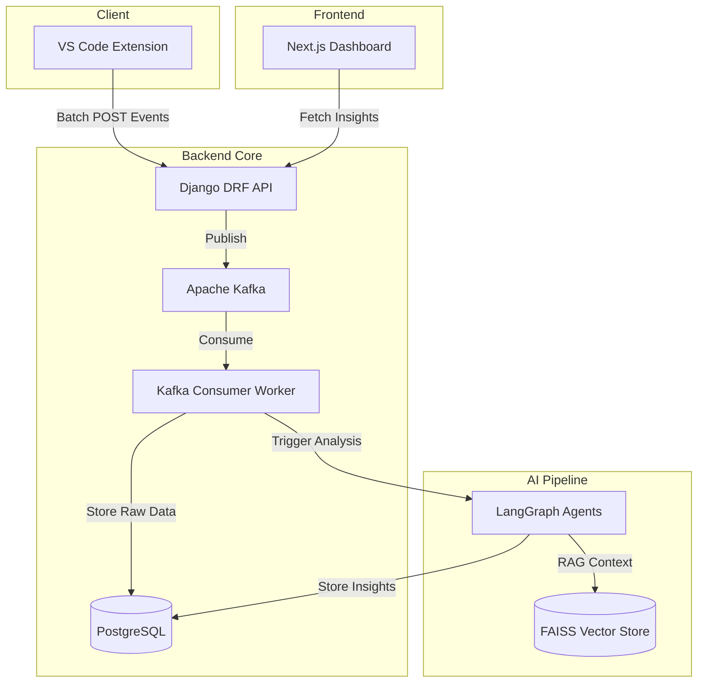

<div align="center">
  

  <br />
  <br />

  <p>
    <b>AI-powered developer telemetry platform that continuously analyzes your coding activity to generate insights on productivity, skill growth, debugging patterns, and career progression.</b>
  </p>
  <p><i>Think <strong>Spotify Wrapped for developers</strong> — powered by real telemetry from your IDE.</i></p>

  <p>
    <a href="https://github.com/Nyx-abu/developer-dna/stargazers"></a>
    <a href="https://github.com/Nyx-abu/developer-dna/network/members"></a>
    <a href="https://github.com/Nyx-abu/developer-dna/issues"></a>
    <a href="https://github.com/Nyx-abu/developer-dna/pulls"></a>
    <br />
    
    
  </p>
  <p>
    
    
    
    
  </p>

  <h4>
    <a href="#-features">Features</a>
    <span> | </span>
    <a href="#-getting-started-5-minutes">Getting Started</a>
    <span> | </span>
    <a href="#%EF%B8%8F-architecture">Architecture</a>
    <span> | </span>
    <a href="#-contributing">Contributing</a>
  </h4>
</div>

---

## 📖 About Developer DNA

**Developer DNA** is an open-source initiative designed to help developers quantify their coding journey. By silently capturing IDE events—from file saves and terminal commands to debugging sessions—our platform leverages advanced AI (like Gemini and Qwen) to map out your skill progression, productivity peaks, and areas for improvement.

Our goal is to give every developer a personalized **"Spotify Wrapped"** experience, allowing you to reflect on your career trajectory, discover your unique coding patterns, and optimize your workflow.

---

## 📸 See It In Action

<div align="center">
  
  <p><i>The intuitive, dark-mode Next.js dashboard providing real-time AI insights.</i></p>
</div>

---

## ✨ Features

- 🧠 **AI-Driven Insights:** Uses a 5-agent LangGraph pipeline (Skill, Productivity, Debug, Career, Report) to process your data.
- 📊 **Beautiful Dashboards:** A sleek Next.js interface displaying coding heatmaps, error distribution charts, and skill radars.
- 🔌 **Seamless IDE Integration:** A VS Code extension silently watches your typing, git operations, and terminal errors without impacting performance.
- 🚀 **Asynchronous & Scalable:** Powered by Apache Kafka for event streaming and PostgreSQL for robust storage.
- 🔒 **Privacy First:** Your code telemetry is processed locally or via secure API, never exposing sensitive secrets.

---

## ⚡ Getting Started (5 minutes)

### Prerequisites
- [Docker Desktop](https://docs.docker.com/desktop/) (with Docker Compose v2+)
- [Node.js 22+](https://nodejs.org/)
- [Python 3.12+](https://python.org/)
- A free [Gemini API key](https://aistudio.google.com/apikey)

### 1. Clone & Configure

```bash
git clone https://github.com/Nyx-abu/developer-dna.git
cd developer-dna
cp .env.example .env
```
Edit `.env` and add your Gemini API key:
```env
GEMINI_API_KEY=your-key-here
```

### 2. Start the Engines 🚀

```bash
make up
```
This single command spins up PostgreSQL, Kafka, the Django REST API, background workers, and the Next.js frontend!

### 3. Run Migrations & Seed Data

```bash
make migrate
make seed
```

### 4. Install the VS Code Extension

```bash
cd extension
npm install
npm run compile
```
Press `F5` in VS Code to launch the Extension Development Host and start tracking! 

Dashboard available at: **http://localhost:3000** 

---

## 🏗️ Architecture



---

## 📁 Project Structure

```text
developer-dna/
├── backend/          # Django 5 + DRF + LangGraph agents
├── frontend/         # Next.js 14 dashboard (React, Tailwind)
├── extension/        # VS Code extension telemetry watchers
├── docs/             # Images and architecture documentation
├── docker-compose.yml
└── Makefile
```

---

## 🤝 Contributing

We welcome contributions from the community! Please read our [CONTRIBUTING.md](CONTRIBUTING.md) for guidelines on how to report bugs, suggest features, and submit pull requests. Let's build the ultimate developer tool together!

---

## 📜 License

This project is licensed under the MIT License - see the [LICENSE](LICENSE) file for details.

<div align="center">
  <br/>
  <sub>Built with ❤️ by the Developer DNA Open Source Community</sub>
</div>
