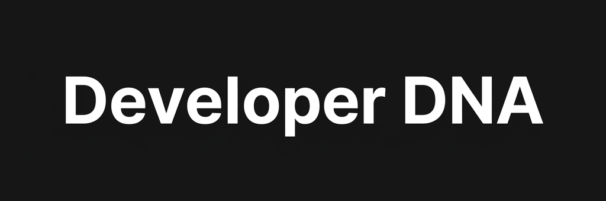
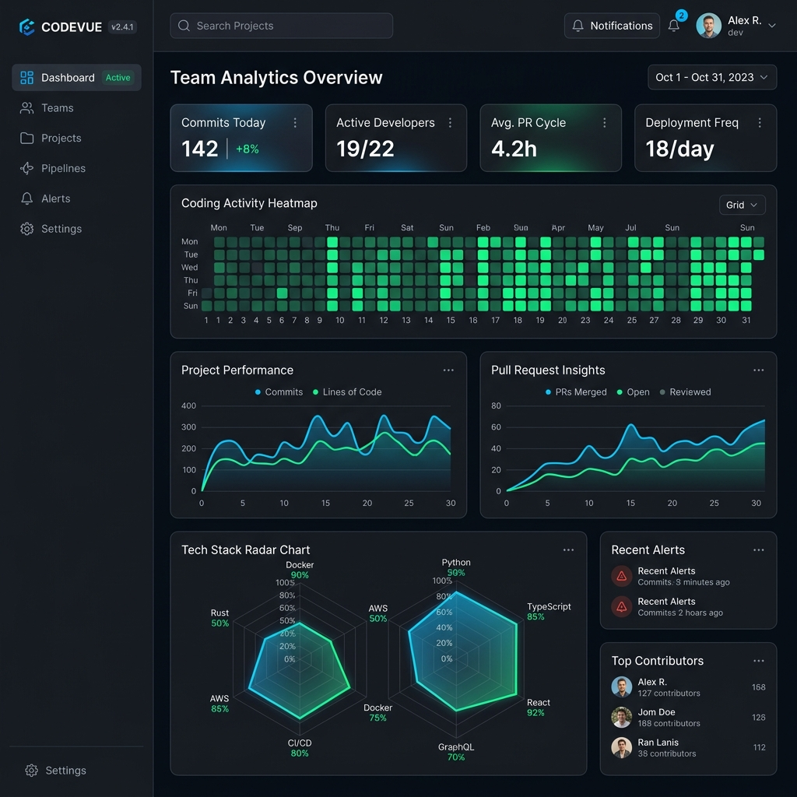
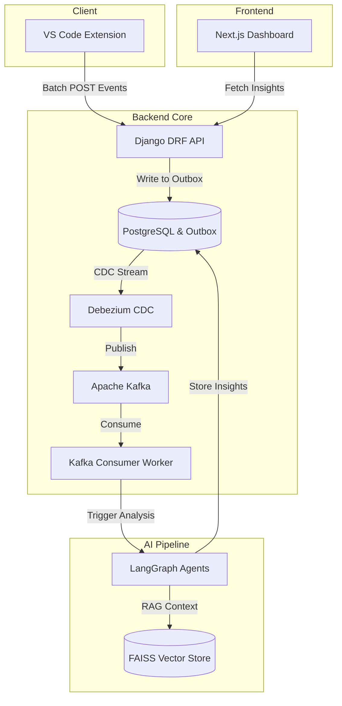

<div align="center">
  
  <br />
  <br />
  <p>
    <b>AI-powered developer telemetry platform that continuously analyzes your coding activity to generate insights on productivity, skill growth, debugging patterns, and career progression.</b>
  </p>
  <p><i>Think Spotify Wrapped for developers, powered by real telemetry from your IDE.</i></p>
  <p>
    <a href="https://github.com/Nyx-abu/developer-dna/stargazers"></a>
    <a href="https://github.com/Nyx-abu/developer-dna/network/members"></a>
    <a href="https://github.com/Nyx-abu/developer-dna/issues"></a>
    <a href="https://github.com/Nyx-abu/developer-dna/pulls"></a>
    <br />
    
    
  </p>
  <p>
    
    
    
    
  </p>
</div>

---

## The Vision: Your Coding Journey, Quantified

Developers write thousands of lines of code, debug countless complex errors, and adopt new frameworks daily. Yet, there is no definitive way to reflect on these achievements, visualize skill growth, or identify workflow bottlenecks.

**Developer DNA** solves this by acting as your personal engineering analyst. It is an open-source initiative designed to help you quantify your coding journey. By capturing granular IDE events in the background, Developer DNA builds a comprehensive profile of your engineering habits and uses AI to provide actionable insights.

---

## See It In Action

<div align="center">
  
  <p><i>The intuitive, dark-mode Next.js dashboard providing real-time AI insights.</i></p>
</div>

---

## What It Does

Developer DNA transforms raw telemetry into a meaningful narrative of your career. It delivers a personalized, data-driven reflection of your work, enabling you to:

- **Understand Your Workflow:** Visualize your productivity peaks, coding heatmaps, and focus periods.
- **Track Skill Progression:** Monitor the languages and frameworks you use most and see your mastery evolve over time.
- **Analyze Debugging Patterns:** Review your error distribution and understand how you tackle and resolve complex bugs.
- **Plan Career Growth:** Receive AI-generated insights and reports on your strengths and areas for improvement.

---

## How It Does It

The platform operates on a scalable architecture designed for privacy and performance.

1. **IDE Integration:** A VS Code extension silently watches your typing, git operations, and terminal errors. It runs with zero impact on your local machine's performance.
2. **Reliable Asynchronous Pipeline:** Telemetry data is saved to a local PostgreSQL outbox table using the **Outbox Pattern**, ensuring no data loss. **Debezium** captures these changes (CDC) and streams them via **Apache Kafka** to background workers.
3. **Advanced AI Analysis:** A 5-agent LangGraph pipeline, powered by LLMs like Gemini and Qwen, analyzes the raw data. It categorizes events into distinct dimensions: Skill, Productivity, Debug, Career, and Report generation.
4. **Rich Data Visualization:** A sleek Next.js interface presents the insights, pulling processed analytics securely from a Django REST framework API.
5. **Full-Stack Observability:** Instrumented completely with **OpenTelemetry**, providing distributed tracing and metrics visualization across the entire stack via **Jaeger**.
6. **Privacy First Design:** Your code telemetry remains under your control. Secrets are never exposed, and the system can be run entirely on your local infrastructure.

---

## Enterprise Deployment & Usage

Developer DNA is designed for robust enterprise deployments. It seamlessly integrates into corporate networks and adheres to strict security standards.

### Enterprise Considerations
- **Data Residency & Privacy:** All IDE telemetry and analytics are stored on your self-hosted infrastructure. No proprietary code is sent to external APIs (unless opting for cloud LLMs).
- **Identity & Access Management (IAM):** Integrates out-of-the-box with Okta, Azure AD, and Keycloak via OIDC for secure Single Sign-On (SSO).
- **Scalability:** The architecture (Kafka + Debezium) is built for horizontal scaling to support thousands of developers concurrently.
- **Role-Based Access Control (RBAC):** Define custom roles to manage who can view team analytics versus personal insights.

---

## Installation & Setup

### Prerequisites
- Docker Desktop (with Docker Compose v2+)
- Node.js 22+
- Python 3.12+
- A free Gemini API key

### 1. Clone & Configure

```bash
git clone https://github.com/Nyx-abu/developer-dna.git
cd developer-dna
cp .env.example .env
```
Edit `.env` and add your Gemini API key:
```env
GEMINI_API_KEY=your-key-here
```

### 2. Start the Engines

```bash
make up
```
This single command spins up PostgreSQL, Kafka, the Django REST API, background workers, and the Next.js frontend.

### 3. Run Migrations & Seed Data

```bash
make migrate
make seed
```

### 4. Install the VS Code Extension

```bash
cd extension
npm install
npm run compile
```
Press `F5` in VS Code to launch the Extension Development Host and start tracking.

Dashboard available at: **http://localhost:3000**

---

## Architecture Flow



---

## Roadmap

- [x] Initial VS Code Extension Release
- [x] Django Backend and Kafka Integration
- [ ] Support for IntelliJ IDEA / WebStorm
- [ ] Advanced AI Career Path Recommendations
- [ ] Team-level Analytics Dashboard

---

## Project Structure

```text
developer-dna/
├── backend/          # Django 5 + DRF + LangGraph agents
├── frontend/         # Next.js 14 dashboard (React, Tailwind)
├── extension/        # VS Code extension telemetry watchers
├── docs/             # Images and architecture documentation
├── docker-compose.yml
└── Makefile
```

---

## Contributing

We welcome contributions from the community. Please read our [CONTRIBUTING.md](CONTRIBUTING.md) for guidelines on how to report bugs, suggest features, and submit pull requests. Let's build the ultimate developer tool together.

---

## License

This project is licensed under the MIT License - see the [LICENSE](LICENSE) file for details.

<div align="center">
  <br/>
  <sub>Built by the Developer DNA Open Source Community</sub>
</div>
